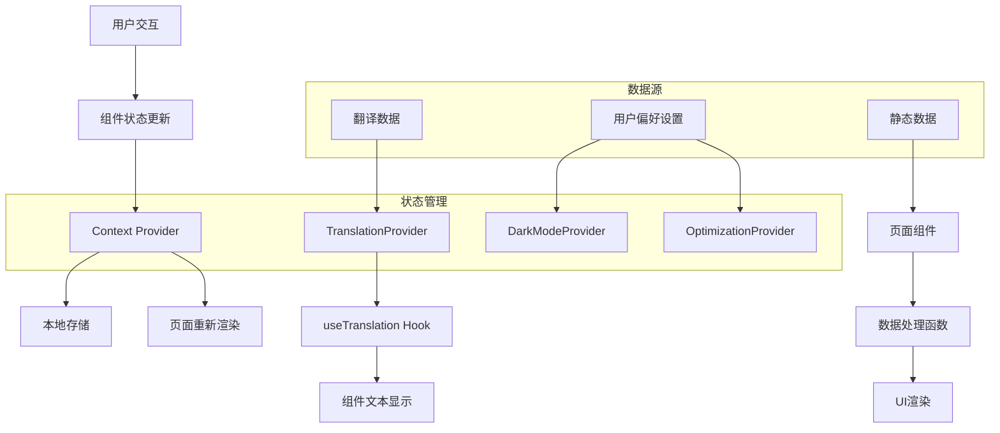

# 牟昭阳个人网站技术架构文档

## 1. Architecture design

```mermaid
graph TD
    A[用户浏览器] --> B[React前端应用]
    B --> C[本地数据服务]
    B --> D[翻译API服务]
    
    subgraph "前端层"
        B
        B1[GlobalOptimizationManager - 性能优化管理]
        B2[TranslationProvider - 多语言支持]
        B3[DarkModeProvider - 主题切换]
        B4[页面组件层]
        B5[交互效果组件]
        B6[加载优化组件]
        B7[搜索筛选组件]
        B8[模态框组件]
        
        B --> B1
        B --> B2
        B --> B3
        B --> B4
        B --> B5
        B --> B6
        B --> B7
        B --> B8
    end
    
    subgraph "数据层"
        C
        E[本地JSON数据文件]
        F[翻译字典文件 (zh.json/en.json)]
        G[静态资源文件]
    end
    
    subgraph "外部服务"
        D[翻译API服务]
        H[性能监控服务]
    end
    
    C --> E
    C --> F
    C --> G
    B2 --> D
    B1 --> H
```

## 2. Technology Description

### 2.1 核心技术栈

* **Frontend**: React\@18 + TypeScript + Tailwind CSS\@3 + Vite + Framer Motion

* **状态管理**: Zustand (轻量级状态管理)

* **路由**: React Router DOM\@6

* **图表库**: Recharts (用于技能雷达图等数据可视化)

* **动画库**: Framer Motion (页面过渡和交互动画)

* **构建工具**: Vite (快速构建和热重载)

* **类型检查**: TypeScript (类型安全)

* **样式系统**: Tailwind CSS (原子化CSS框架)

* **部署**: Vercel (前端静态部署)

**注意：** 当前版本为纯前端应用，数据通过本地JSON文件和翻译服务提供，未使用Supabase后端服务。

### 2.2 高级功能模块

* **性能优化系统**: GlobalOptimizationManager + AdvancedPerformanceOptimization

* **国际化系统**: TranslationProvider + 智能翻译服务 (zh/en)

* **主题系统**: DarkModeProvider + 深色/浅色/系统主题

* **可访问性增强**: AccessibilityEnhancements + 屏幕阅读器支持

* **响应式设计**: ResponsiveEnhancements + 移动端优化

* **交互效果**: InteractiveEffects + 高级动画系统

* **SEO优化**: SEOOptimization + 结构化数据

* **加载优化**: LoadingComponents + 骨架屏 + 懒加载

## 3. Route definitions

| Route         | Purpose                | 实际实现页面           |
| ------------- | ---------------------- | ---------------- |
| /             | 首页，展示个人介绍、研究亮点和最新动态    | Home.tsx         |
| /research     | 研究方向页，详细介绍科学计算和机器人研究   | Research.tsx     |
| /projects     | 项目展示页，展示核心项目和技术成果      | Projects.tsx     |
| /publications | 学术成果页，展示论文、专利和学术活动     | Publications.tsx |
| /skills       | 技能与工具页，展示技术能力和工具熟练度    | Skills.tsx       |
| /contact      | 联系方式页，提供联系信息和合作表单      | Contact.tsx      |
| /ascii        | ASCII演示页，展示创意ASCII艺术效果 | ASCII.tsx        |

**注意：** 当前实现为纯前端应用，暂未实现管理后台功能。

## 4. 高级功能架构

### 4.1 性能优化系统

**GlobalOptimizationManager**

* 实时性能监控 (LCP, FID, CLS, FCP)

* 自适应配置优化 (移动端/网络/内存)

* 性能指标可视化面板

* 智能资源预加载

**AdvancedPerformanceOptimization**

* 代码分割与懒加载

* 网络状态监测

* 内存使用优化

* 缓存策略管理

### 4.2 国际化系统

**TranslationProvider**

* 中英文双语支持

* 智能翻译服务集成

* 本地翻译缓存

* 浏览器语言检测

* 实时页面内容翻译

### 4.3 主题与可访问性

**DarkModeProvider**

* 深色/浅色/系统主题

* 平滑主题切换动画

* 系统偏好检测

* 主题状态持久化

**AccessibilityEnhancements**

* 高对比度模式

* 大字体支持

* 减少动画选项

* 键盘导航增强

* 屏幕阅读器支持

* 文本转语音功能

* 色盲友好模式

### 4.4 响应式与交互

**ResponsiveEnhancements**

* 多设备断点检测

* 响应式容器组件

* 自适应网格布局

* 移动端菜单系统

**InteractiveEffects**

* 鼠标跟随效果

* 磁性按钮交互

* 悬浮卡片动画

* 滚动触发动画

* 打字机文本效果

* 粒子背景系统

### 4.5 SEO与加载优化

**SEOOptimization**

* 动态Meta标签管理

* 结构化数据 (JSON-LD)

* Open Graph支持

* 页面特定SEO配置

**LoadingComponents**

* 智能骨架屏系统

* 页面加载动画

* 组件级加载状态

* 渐进式内容加载

## 5. 数据结构与管理

### 5.1 本地数据结构

**项目数据 (Projects.tsx)**

```typescript
interface Project {
  id: string;
  title: string;
  description: string;
  category: string;
  status: string;
  year: number;
  technologies: string[];
  image: string;
  github?: string;
  demo?: string;
  paper?: string;
}
```

**学术成果数据 (Publications.tsx)**

```typescript
interface Publication {
  id: string;
  type: 'paper' | 'patent' | 'award';
  title: string;
  authors?: string[];
  journal?: string;
  year: number;
  doi?: string;
  citations?: number;
  patentNumber?: string;
  applicant?: string;
  publicationDate?: string;
  awardingBody?: string;
  awardDate?: string;
  certificateNumber?: string;
  status: string;
  level?: string;
}
```

**技能数据 (Skills.tsx)**

```typescript
interface Skill {
  name: string;
  level: number;
  category: string;
  projects?: string[];
}

interface SkillCategory {
  name: string;
  skills: Skill[];
  color: string;
}
```

### 5.2 翻译数据结构

**中文翻译文件 (zh.json)**

```json
{
  "nav": {
    "home": "首页",
    "research": "研究方向",
    "projects": "项目展示",
    "publications": "学术成果",
    "skills": "技能与工具",
    "contact": "联系方式",
    "ascii": "ASCII演示"
  },
  "home": {
    "hero": {
      "name": "牟昭阳",
      "title": "博士研究生",
      "description": "专注于科学计算与机器人技术研究"
    },
    "stats": {
      "papers": "论文",
      "projects": "项目",
      "patents": "专利",
      "awards": "奖项"
    }
  }
}
```

**英文翻译文件 (en.json)**

```json
{
  "nav": {
    "home": "Home",
    "research": "Research",
    "projects": "Projects",
    "publications": "Publications",
    "skills": "Skills",
    "contact": "Contact",
    "ascii": "ASCII Demo"
  },
  "home": {
    "hero": {
      "name": "Zhaoyang Mou",
      "title": "PhD Student",
      "description": "Focused on Scientific Computing and Robotics Research"
    },
    "stats": {
      "papers": "Papers",
      "projects": "Projects",
      "patents": "Patents",
      "awards": "Awards"
    }
  }
}
```

## 6. 组件架构与依赖关系

### 6.1 核心组件依赖图

```mermaid
graph TD
    App[App.tsx] --> Router[React Router]
    App --> GM[GlobalOptimizationManager]
    App --> TP[TranslationProvider]
    App --> DM[DarkModeProvider]
    
    Router --> Home[Home.tsx]
    Router --> Research[Research.tsx]
    Router --> Projects[Projects.tsx]
    Router --> Publications[Publications.tsx]
    Router --> Skills[Skills.tsx]
    Router --> Contact[Contact.tsx]
    Router --> ASCII[ASCII.tsx]
    
    GM --> APO[AdvancedPerformanceOptimization]
    GM --> RE[ResponsiveEnhancements]
    GM --> PLA[PageLoadingAnimations]
    
    TP --> TS[translationService]
    TP --> I18N[i18n utils]
    
    Projects --> SF[SearchAndFilter]
    Projects --> UB[UnifiedButton]
    Projects --> LI[LazyImage]
    
    Publications --> RDM[ResearchDetailModal]
    Publications --> SF
    
    Skills --> RC[Recharts]
    Skills --> SM[SimpleMotion]
    
    Home --> IE[InteractiveEffects]
    Home --> LC[LoadingComponents]
    
    subgraph "共享组件"
        SF
        UB
        LI
        SM
        IE
        LC
    end
    
    subgraph "特效组件"
        TA[TraeASCIIBackground]
        ZA[ZhaoyangASCIIText]
        ZR[ZhaoyangASCIIRhythm]
        PR[PixelRhythm]
    end
    
    Home --> TA
    Home --> ZA
    ASCII --> ZR
    ASCII --> PR
```



### 6.2 Hook系统架构

| Hook名称            | 功能描述     | 依赖组件                      | 实际使用页面                 |
| ----------------- | -------- | ------------------------- | ---------------------- |
| useOptimization   | 性能优化配置管理 | GlobalOptimizationManager | 全局使用                   |
| useTranslation    | 国际化翻译功能  | TranslationProvider       | 所有页面                   |
| useTheme          | 主题切换管理   | DarkModeProvider          | 全局使用                   |
| useResponsive     | 响应式断点检测  | ResponsiveEnhancements    | 部分组件                   |
| useAdvancedSearch | 高级搜索过滤   | SearchAndFilter           | Projects, Publications |
| useLocalStorage   | 本地存储管理   | 自定义Hook                   | 主题、语言设置                |
| useDebounce       | 防抖处理     | 自定义Hook                   | 搜索功能                   |

### 6.3 样式系统架构

**CSS模块化结构**

* `index.css` - 全局基础样式

* `animations.css` - 动画效果样式

* `accessibility.css` - 可访问性样式

* `dark-mode.css` - 深色模式样式

* Tailwind CSS - 原子化样式系统

**主题变量系统**

```css
:root {
  --primary-color: #3b82f6;
  --secondary-color: #64748b;
  --accent-color: #f59e0b;
  --background-color: #ffffff;
  --text-color: #1f2937;
}

.dark {
  --background-color: #111827;
  --text-color: #f9fafb;
}
```

## 7. 前端数据管理

### 7.1 数据管理策略

**静态数据管理**

* 项目数据：直接在 `Projects.tsx` 中定义，通过 `getProjects()` 函数获取

* 学术成果数据：直接在 `Publications.tsx` 中定义，支持论文、专利、奖项三种类型

* 技能数据：直接在 `Skills.tsx` 中定义，包含技能等级和项目案例

* 研究亮点：在 `Home.tsx` 中定义，展示核心研究成果

**多语言数据管理**

* 翻译字典：`zh.json` 和 `en.json` 文件存储所有翻译内容

* 动态翻译：通过 `useTranslation` Hook 实现实时语言切换

* 翻译缓存：本地存储用户语言偏好，提升加载性能

**状态管理**

* 全局状态：使用 React Context 管理主题、语言、性能配置

* 本地状态：使用 React useState 管理组件内部状态

* 持久化：使用 localStorage 保存用户偏好设置

### 7.2 数据流架构



## 8. 性能指标与优化

### 8.1 性能监控指标

| 指标名称                           | 目标值     | 当前实现 | 监控方式                    |
| ------------------------------ | ------- | ---- | ----------------------- |
| LCP (Largest Contentful Paint) | < 2.5s  | 实时监控 | PerformanceObserver API |
| FID (First Input Delay)        | < 100ms | 实时监控 | PerformanceObserver API |
| CLS (Cumulative Layout Shift)  | < 0.1   | 实时监控 | PerformanceObserver API |
| FCP (First Contentful Paint)   | < 1.8s  | 实时监控 | PerformanceObserver API |
| 内存使用率                          | < 80%   | 实时监控 | Performance Memory API  |
| 网络状态                           | 自适应     | 实时检测 | Network Information API |

### 8.2 优化策略

**代码分割优化**

* 路由级别的懒加载

* 组件级别的动态导入

* 第三方库的按需加载

**资源优化**

* 图片懒加载与优化

* 字体预加载

* CSS/JS 压缩与合并

**缓存策略**

* 浏览器缓存配置

* Service Worker 缓存

* 翻译内容缓存

## 9. 部署与运维

### 9.1 部署配置

**Vercel 部署配置 (vercel.json)**

```json
{
  "builds": [
    {
      "src": "package.json",
      "use": "@vercel/static-build",
      "config": {
        "distDir": "dist"
      }
    }
  ],
  "routes": [
    {
      "src": "/(.*)",
      "dest": "/index.html"
    }
  ],
  "headers": [
    {
      "source": "/(.*)",
      "headers": [
        {
          "key": "Cache-Control",
          "value": "public, max-age=31536000, immutable"
        }
      ]
    }
  ]
}
```

**环境变量配置**

* `VITE_APP_TITLE` - 应用标题

* `VITE_TRANSLATION_API_KEY` - 翻译服务 API 密钥（可选）

* `VITE_ANALYTICS_ID` - 分析服务 ID（可选）

**构建脚本 (package.json)**

```json
{
  "scripts": {
    "dev": "vite",
    "build": "tsc && vite build",
    "preview": "vite preview",
    "type-check": "tsc --noEmit"
  }
}
```

### 9.2 监控与日志

**性能监控**

* 实时性能指标收集

* 用户体验指标追踪

* 错误日志记录

**SEO监控**

* 搜索引擎收录状态

* 页面加载速度监控

* 移动端友好性检测

## 10. 技术特色与创新点

### 10.1 智能性能优化系统

* **自适应配置**：基于设备类型和网络状况的智能优化策略

* **实时监控**：Performance Observer API 实时收集性能指标

* **懒加载策略**：组件级和路由级的智能懒加载

* **资源优化**：图片懒加载、代码分割、缓存策略

### 10.2 完整的多语言支持系统

* **双语切换**：中英文无缝切换，支持浏览器语言检测

* **翻译缓存**：本地存储翻译内容，提升加载性能

* **实时翻译**：页面内容实时翻译，无需刷新

* **扩展性**：易于添加新语言支持

### 10.3 现代化主题系统

* **多主题支持**：浅色、深色、系统主题自动切换

* **平滑过渡**：CSS变量实现主题切换动画

* **系统集成**：自动检测系统主题偏好

* **持久化**：用户主题偏好本地存储

### 10.4 企业级组件架构

* **TypeScript 类型安全**：完整的类型定义和检查

* **模块化设计**：高度可复用的组件和 Hook 系统

* **性能优化**：React.memo、useMemo、useCallback 优化

* **错误处理**：完善的错误边界和异常处理

### 10.5 创新的交互体验

* **ASCII 艺术效果**：独特的 ASCII 背景和文字动画

* **动态效果**：Framer Motion 驱动的页面过渡和交互动画

* **响应式设计**：完美适配桌面、平板、移动端

* **可访问性**：支持键盘导航和屏幕阅读器

### 10.6 数据可视化能力

* **技能雷达图**：Recharts 实现的交互式技能展示

* **项目筛选**：高级搜索和多维度筛选功能

* **模态框详情**：丰富的学术成果详情展示

* **统计数据**：首页动态统计数据展示

## 11. 未来扩展规划

### 11.1 后端集成计划

* **数据库集成**：考虑集成 Supabase 或其他后端服务

* **内容管理**：开发管理后台，支持动态内容更新

* **用户系统**：添加用户认证和个性化功能

* **API 接口**：提供 RESTful API 支持

### 11.2 功能增强计划

* **搜索优化**：全文搜索和智能推荐

* **社交功能**：集成学术社交媒体链接

* **博客系统**：添加技术博客和研究笔记

* **评论系统**：支持访客留言和反馈

### 11.3 性能优化计划

* **CDN 集成**：静态资源 CDN 加速

* **PWA 支持**：渐进式 Web 应用功能

* **离线缓存**：Service Worker 离线访问

* **预渲染**：SSG 静态生成优化 SEO

